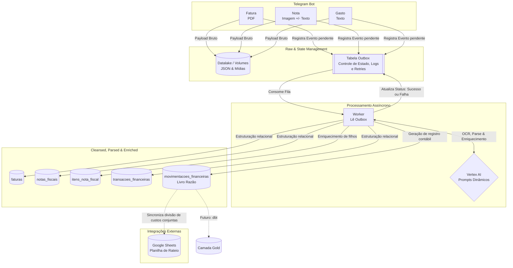

  
# Fluxo de Caixa Automatizado - ETL Financeiro com LLM


## O Projeto
Uma arquitetura de dados *end-to-end* desenvolvida em Python e conteinerizada via Docker, projetada para automatizar a ingestão e estruturação de gastos pessoais, além de manter uma divisão igualitária das contas conjuntas. 

O sistema utiliza um Bot do Telegram como interface de entrada, processa os dados com a Vertex AI (Gemini 2.5 Pro) através de *prompts* dinâmicos e alimenta um Data Warehouse local em PostgreSQL, garantindo resiliência e consistência de dados em todas as etapas.

---

## Arquitetura do Pipeline

A arquitetura segue o padrão *Medallion* (Bronze, Silver, Gold), com um forte foco em resiliência transacional através do padrão Outbox, garantindo que nenhuma transação seja perdida em caso de falhas de rede ou indisponibilidade de APIs.



### Camada Bronze (Raw) & Resiliência
*   **Ingestão Multifonte:** O bot possui funções distintas que aceitam formatos variados, o que determina o roteamento e os *prompts* dinâmicos subsequentes:
    1.  **Fatura:** Ingestão de documentos PDF.
    2.  **Nota:** Ingestão de imagens (fotos de cupons fiscais) acompanhadas ou não de texto de apoio.
    3.  **Gasto:** Descrição textual direta de uma movimentação.
*   **Armazenamento e Outbox:** O *payload* bruto é salvo no datalake (volumes Docker), enquanto um registro é criado na tabela **Outbox**. Essa tabela atua como a espinha dorsal de resiliência da aplicação: gerencia o estado de cada processamento, armazena logs detalhados e garante que, em caso de erro (ex: *timeout* da LLM), o evento fique pendente para *retry*, impedindo perda de dados (problema clássico no mundo real).

### Camada Silver (Cleansed/Parsed/Enriched)
*   **Processamento & Prompts Dinâmicos:** O *Worker* consome os eventos do Outbox e envia para a Vertex AI utilizando um *prompt* específico para cada tipo de entrada (Fatura, Nota ou Gasto).
*   **Modelagem Relacional (5 Tabelas):** Os dados não-estruturados são divididos, enriquecidos e tipados em cinco entidades principais:
    1.  `silver.faturas`
    2.  `silver.notas_fiscais`
    3.  `silver.itens_nota_fiscal` (Enriquecimento em nível de item, permitindo o acompanhamento de inflação pessoal e viabilizando futuros algoritmos de *Machine Learning* para otimização de compras).
    4.  `silver.transacoes_financeiras` (Compras individuais no cartão).
    5.  `silver.movimentacoes_financeiras` (O Livro Razão universal, que unifica PIX, despesas sem nota e os rateios).
*   **Sincronização com Google Sheets:** Quando o processamento identifica um gasto conjunto (regra de rateio entre Diogo e Flora), além de alimentar o Livro Razão, o sistema realiza uma integração secundária para registrar e atualizar os valores em uma planilha compartilhada no Google Sheets, mantendo a transparência em tempo real.

### Camada Gold (Analytics) *Em breve*
*   Modelagem dimensional via **dbt** voltada para BI e criação de visões analíticas agregadas.

---

## Destaques de Engenharia

*   **Tolerância a Falhas (Real-World Resilience):** Uso profundo do *Outbox Pattern*. Falhas de rede, indisponibilidade da Vertex AI ou instabilidades no Telegram não geram perda de informações. Tudo é enfileirado, logado e passível de reprocessamento autônomo.
*   **FinOps & Observabilidade:** Rastreamento ponta a ponta do consumo da LLM (latência, `prompt_tokens`, `output_tokens`, `total_tokens` e `thoughts_tokens`) atrelado a cada requisição na base de dados, permitindo a extração do custo unitário por processamento.
*   **Clean Architecture:** Separação estrita de responsabilidades (`delivery`, `usecases`, `services`, `infrastructure`), garantindo baixo acoplamento e facilitando a manutenção e a criação de testes.
*   **Idempotência e Segurança:** Tratamento robusto para evitar duplicações (*constraints* lógicas e físicas no BD), exclusão lógica (*soft delete*), e controle de acesso baseado no ID do Telegram (RBAC), protegendo a aplicação contra interações não autorizadas.

---

## Stack Tecnológico

<div align="left">
  
  
  
  
  
  
  
</div>

<br>

*   **Bibliotecas Principais:** `python-telegram-bot`, `google-genai`, `pypdf`, `psycopg2`

---

## Estrutura do Repositório

```text
├── app/
│   ├── delivery/        # Interfaces externas (Telegram Handlers)
│   ├── usecases/        # Regras de negócio (ex: cálculos de rateio, roteamento de prompts)
│   ├── services/        # Integração com APIs externas (Vertex AI, Google Sheets)
│   ├── infrastructure/  # Repositórios, acesso ao Postgres, Gerenciamento do Outbox
│   └── main.py          # Entrypoint e injeção de dependências
├── volumes/             # Datalake (Camada Bronze Mídias) e persistência do Postgres
├── docker-compose.yml   # Declaração dos containers
├── requirements.txt     # Dependências Python
└── README.md
```

---

## Roadmap & Próximos Passos (A Evolução para MDS)

- [ ] **Orquestração com Apache Airflow:** Transição do loop assíncrono do *worker* para DAGs gerenciadas e agendadas, centralizando a observabilidade.
- [ ] **Transformação com dbt:** Adoção do *Data Build Tool* para materialização de regras de negócio complexas, reconciliação de datas e testes de qualidade de dados (Data Contracts) na camada Gold.
- [ ] **Data Visualization:** *Deploy* do Metabase para a criação de *dashboards* interativos de acompanhamento financeiro conjunto.